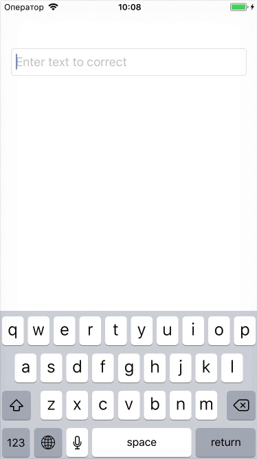

# About

This Xcode project contains the implementation of [LinSpell](https://github.com/wolfgarbe/LinSpell) spelling correction algorithm written on Swift. I also included the Objective-C version if it's needed for someone.

The speed of this algorithm is lower than original implementation in C# but primarily because of my limited knowledge of Swift programming language. From my opinion there are some ways to improve the performance.

**Note:** The app version with `Release` configuration will be faster than `Debug`. You can change the `Optimization Level` in `Build Settings` of your project to change this behaviour for debugging.

